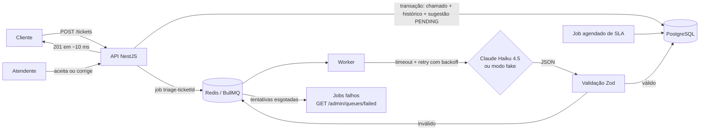
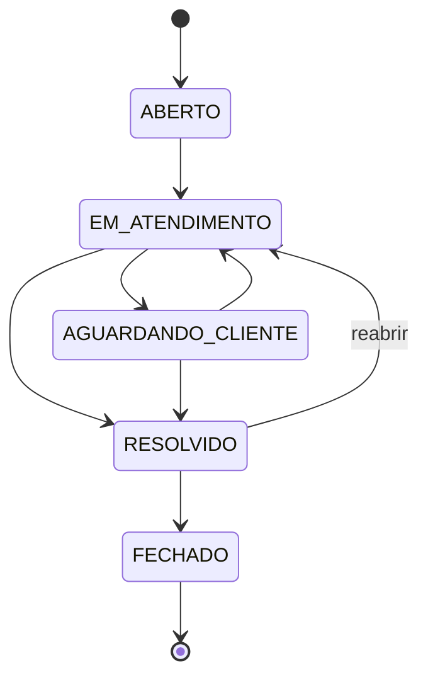
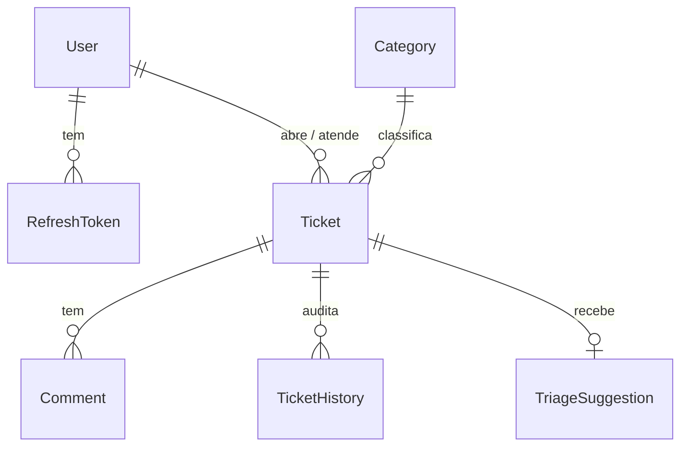

# HelpDesk API

[](https://github.com/LeopratesDev/helpdesk-api/actions/workflows/ci.yml)


API REST de uma central de suporte: clientes abrem chamados, uma **IA (Claude, da Anthropic) sugere categoria e prioridade em segundo plano**, atendentes tratam a fila e o sistema controla o **SLA**.

## Por que este projeto existe

Antes de programar, eu trabalhei do outro lado do chamado: atendimento (SAC na Concentrix) e suporte técnico. Vivi a fila sem prioridade clara, o chamado crítico escondido atrás de dez dúvidas simples, o prazo estourado que ninguém viu e o "quem mexeu nisso?" sem resposta.

**Eu atendia chamados; agora construí o sistema que os organiza.** Cada regra aqui vem dessa vivência:

| Dor no atendimento | Como a API resolve |
|---|---|
| Triagem manual, lenta e inconsistente | IA sugere categoria, prioridade e um resumo de 1 linha; o atendente só aceita ou corrige |
| Prazo estourado sem ninguém perceber | SLA calculado por prioridade + job que marca os vencidos automaticamente |
| "Quem mudou o status?" | Histórico de auditoria gravado na mesma transação de cada mudança |
| Chamado pulando etapas ou reaberto de qualquer jeito | Máquina de status com transições proibidas (e testadas) |
| Anotação interna vazando para o cliente | Comentários públicos × internos, filtrados por papel |
| Gestor sem números | `/metrics/overview`: tempos médios, % no SLA e taxa de acerto da IA |

## Arquitetura

Um monólito modular (NestJS) com **dois processos** a partir do mesmo código: a **API** (HTTP) e o **worker** (filas). Sem microsserviços.



**Status do chamado** (qualquer outra transição responde `422`):



<details>
<summary><b>Modelo de dados</b></summary>



</details>

**Módulos de domínio** (`src/`): `auth`, `users`, `categories`, `tickets` (chamados, status, comentários, histórico), `sla`, `triage`, `metrics`, além de `queue`, `health`, `config` e `common` (erros, validação, logs). Regras de negócio ficam em services e funções puras (`ticket-status.ts`, `sla.policy.ts`, `triage.schema.ts`, `metrics.calc.ts`); controllers só traduzem HTTP. DTOs de entrada e saída são separados do modelo do banco (a senha, por exemplo, nunca sai da API).

## Tecnologias

| Área | Escolha |
|---|---|
| Runtime / linguagem | Node.js 24 LTS, TypeScript `strict` |
| Framework | NestJS 11 (módulos, injeção de dependência, guards, pipes, filters) |
| Banco | PostgreSQL 17 + Prisma (migrations versionadas, índices, transações) |
| Filas | BullMQ + Redis (worker de triagem, job agendado de SLA, jobs falhos visíveis) |
| IA | SDK oficial `@anthropic-ai/sdk`, Claude Haiku 4.5, saída validada com Zod |
| Validação | `class-validator` nos DTOs; Zod na configuração e na saída do LLM |
| Erros | ProblemDetails (RFC 7807) com 400, 401, 403, 404, 409, 422, 429 |
| Segurança | argon2, JWT + refresh token com rotação, rate limit no login, Helmet, CORS restrito |
| Observabilidade | Pino (JSON) com correlation id (`x-request-id`), `/health` |
| Testes | Jest, Supertest, Testcontainers (PostgreSQL e Redis reais) |
| Entrega | Docker (multi-stage, usuário não root), Docker Compose, GitHub Actions |

## Como rodar

### Com Docker (recomendado)

Requisito: Docker Desktop. Nenhuma chave é necessária.

```bash
git clone https://github.com/LeopratesDev/helpdesk-api.git
cd helpdesk-api
docker compose up --build
```

Isso sobe PostgreSQL, Redis, aplica as migrations, popula o banco (só se estiver vazio), e inicia a **API** e o **worker**.

- Swagger: http://localhost:3000/docs (clique em **Authorize** e cole o `accessToken` do login)
- Saúde: http://localhost:3000/health
- Porta 3000 ocupada? `API_PORT=3100 docker compose up --build`
- Para usar o Claude de verdade: `ANTHROPIC_API_KEY=sk-ant-... docker compose up --build`

### Sem Docker para a aplicação

Requisitos: Node.js 24+, PostgreSQL 17 e Redis 7 rodando (instalados localmente, ou só os dois via `docker compose up postgres redis`).

```bash
npm ci
cp .env.example .env          # ajuste DATABASE_URL, REDIS_URL e JWT_SECRET se preciso
npm run db:deploy             # aplica as migrations
npm run db:seed               # dados de demonstração (apaga e recria)
npm run start:dev             # API em http://localhost:3000
npm run start:worker:dev      # em outro terminal: worker (triagem e SLA)
```

Todas as variáveis estão documentadas em [`.env.example`](.env.example). Se faltar uma obrigatória ou algum valor for inválido, a aplicação **não sobe** e diz qual é.

### Modo fake do LLM

Sem `ANTHROPIC_API_KEY`, a triagem usa regras locais por palavra-chave: o fluxo completo (fila → worker → sugestão → aceitar/corrigir) funciona sem rede e sem custo. O log do worker avisa: `triagem em MODO FAKE`. Detalhes no [ADR 003](docs/adr/003-modo-fake-do-llm.md).

## Usuários de demonstração

Todos com a senha **`Demo@123`** (criados pelo seed; só existem no seu banco local).

| Papel | E-mail | Pode |
|---|---|---|
| Admin | `admin@helpdesk.dev` | gerenciar usuários e categorias, ver jobs falhos, tudo do atendente |
| Atendente | `atendente@helpdesk.dev` (e `bruna@helpdesk.dev`) | tratar a fila, mudar status, decidir a triagem, ver métricas |
| Cliente | `cliente@helpdesk.dev` (e `carlos@`, `daniela@`) | abrir e acompanhar os próprios chamados |

O seed cria 50 chamados fictícios em todos os status, com histórico, comentários e sugestões da IA.

## Endpoints principais

26 rotas no total; todas documentadas com exemplos em `/docs`.

| Método | Rota | Quem | Descrição |
|---|---|---|---|
| POST | `/auth/login` | público | Access token (15 min) + refresh token. Rate limit: 5/min por IP |
| POST | `/auth/refresh` | público | Troca o refresh token por um novo par (rotação) |
| POST | `/tickets` | Cliente | Abre chamado; responde **201** na hora e enfileira a triagem |
| GET | `/tickets` | todos | Paginado; filtros `status`, `priority`, `categoryId`, `assigneeId`, `from`, `to`; `sortBy`/`sortOrder` |
| PATCH | `/tickets/:id/status` | Atendente, Admin | Transição validada (422 se proibida; 409 se alterado ao mesmo tempo) |
| POST | `/tickets/:id/comments` | dono, Atendente, Admin | Público ou interno (cliente não cria nem vê internos) |
| GET | `/tickets/:id/history` | Atendente, Admin | Auditoria completa |
| GET | `/tickets/:id/triage` | Atendente, Admin | Sugestão da IA, confiança e texto enviado |
| POST | `/tickets/:id/triage/accept` · `/correct` | Atendente, Admin | Aplica a sugestão ou a correção ao chamado |
| GET | `/metrics/overview` | Atendente, Admin | Por status, tempos médios, % no SLA, acerto da IA |
| GET | `/admin/queues/failed` | Admin | Jobs que esgotaram as tentativas |
| GET | `/health` | público | Banco e Redis (200/503) |

Exemplo rápido:

```bash
TOKEN=$(curl -s -X POST localhost:3000/auth/login -H 'content-type: application/json' \
  -d '{"email":"atendente@helpdesk.dev","password":"Demo@123"}' | jq -r .accessToken)
curl -s localhost:3000/metrics/overview -H "Authorization: Bearer $TOKEN" | jq
```

## Testes

```bash
npm test               # tudo (unitários + integração)
npm run test:unit      # só unitários, sem Docker
npm run test:e2e       # integração: sobe PostgreSQL e Redis reais via Testcontainers (precisa de Docker)
npm run test:cov       # com relatório de cobertura em coverage/
```

- **157 testes**: 92 unitários + 65 de integração/E2E.
- **Cobertura das regras de negócio: 97,4% das linhas** (88% dos branches) — máquina de status, SLA, auth, triagem, métricas. Geral do projeto: 96%.
- As **25 combinações** de transição de status são testadas (7 permitidas, 18 proibidas).
- O **LLM é sempre mockado**: nenhum teste chama a API da Anthropic nem gasta dinheiro. A integração usa o worker real com um cliente de LLM falso injetado; o cliente real é testado com o SDK simulado (prompt, parse, erros que valem retry ou não).
- Integração com **banco e Redis reais**, não mocks: migrations, índices, transações, concorrência e filas são exercitados de verdade.

O CI (GitHub Actions) roda lint, typecheck, testes com cobertura, build e o build da imagem Docker em cada push e PR.

## Decisões e trade-offs

**Por que fila, e não chamar o LLM direto na requisição?** O LLM leva segundos, pode dar timeout, limite de taxa (429) ou ficar fora do ar. Na requisição, o cliente esperaria e veria esses erros. Com fila, o `POST /tickets` responde em **~10 ms (mediana; p95 15 ms, medido localmente)** e a triagem acontece depois, com retry e backoff. Custo: mais uma peça (Redis) e consistência eventual (a sugestão aparece segundos depois). → [ADR 001](docs/adr/001-fila-assincrona-para-triagem.md)

**Idempotência do worker.** O mesmo job pode rodar duas vezes (retry, worker que caiu no meio). Três camadas impedem dados duplicados: (1) id de job determinístico `triage-<ticketId>`, que o BullMQ não duplica; (2) `UNIQUE(ticketId)` + `upsert` na sugestão; (3) gravação condicional `WHERE status = 'PENDING'`, que deixa só uma execução gravar. Há testes para reprocessamento e para duas execuções simultâneas.

**Por que Prisma?** Schema como fonte da verdade, migrations versionadas e tipos gerados: mudar uma coluna quebra a compilação onde ela é usada. Onde o Prisma não alcança, uso SQL: o job de SLA é um único `UPDATE ... RETURNING` + `INSERT` (atômico e idempotente) e as métricas agregam no banco. → [ADR 002](docs/adr/002-prisma-como-orm.md)

**Validação: `class-validator` + Zod.** `class-validator` é o padrão do NestJS e gera o Swagger a partir dos mesmos decorators. Zod entra onde o dado vem de fora sem garantia: variáveis de ambiente e a resposta do LLM. Mesmo com "structured outputs", valido de novo: o helper do SDK converte `enum`/`min`/`max` em texto de descrição, então a API não os garante — e a categoria precisa existir no banco.

**Custos e limites do LLM.**
- Modelo: `claude-haiku-4-5` (configurável em `LLM_MODEL`), o mais barato e rápido — triagem é classificação simples. Preço de tabela: US$ 1 / milhão de tokens de entrada e US$ 5 / milhão de saída.
- **Estimativa** (não medida — rodei em modo fake): ~600 tokens de entrada e ~80 de saída por chamado ≈ **US$ 0,001 por triagem**, ~US$ 1 a cada mil chamados.
- Limites tratados: timeout próprio (`LLM_TIMEOUT_MS`), retry com backoff exponencial para 429/5xx/timeout/saída inválida, sem retry para 400/401/403/404 e recusa do modelo, `concurrency: 5` no worker para não estourar o rate limit.
- A IA **sugere**, não decide: o atendente aceita ou corrige, e a taxa de acerto vira métrica.
- O texto do chamado vai delimitado e é tratado como dado (mitiga prompt injection); a saída ainda passa pelo Zod.

**Outros trade-offs conscientes**
- Paginação por offset (simples, mostra total de páginas); por cursor seria melhor para páginas muito altas.
- Lock otimista (`updatedAt` no `WHERE`) em vez de `SELECT ... FOR UPDATE`: conflito é raro, não trava linhas.
- Refresh token opaco guardado como hash, com detecção de reuso; access token JWT curto (não revogável, por isso 15 min).
- Se o Redis estiver fora ao abrir um chamado, o `POST` não falha: a sugestão fica `PENDING` e uma varredura periódica republica. O padrão outbox seria a solução completa (ver próximos passos).

## Próximos passos

- Deploy público (ver etapa de deploy / [issues](https://github.com/LeopratesDev/helpdesk-api/issues)).
- Padrão **outbox** para publicar jobs com garantia transacional.
- Cliente comentando em "Aguardando cliente" → voltar automaticamente para "Em atendimento".
- Notificações (e-mail/webhook) de SLA prestes a vencer, não só estourado.
- Reprocessar job falho pelo painel (`POST /admin/queues/:id/retry`).
- Medir custo real do LLM por chamado (`usage` da resposta) e expor nas métricas.
- Imagem Docker menor (base Alpine ou distroless).

## Documentação

- [ADR 001 — Fila assíncrona para a triagem por IA](docs/adr/001-fila-assincrona-para-triagem.md)
- [ADR 002 — Prisma como ORM](docs/adr/002-prisma-como-orm.md)
- [ADR 003 — Modo fake do LLM](docs/adr/003-modo-fake-do-llm.md)

---

Feito por **Leonardo Prates** · [GitHub](https://github.com/LeopratesDev) · Outro projeto: [RH Manager](https://github.com/LeopratesDev/rh-manager) (C#/.NET + React)
